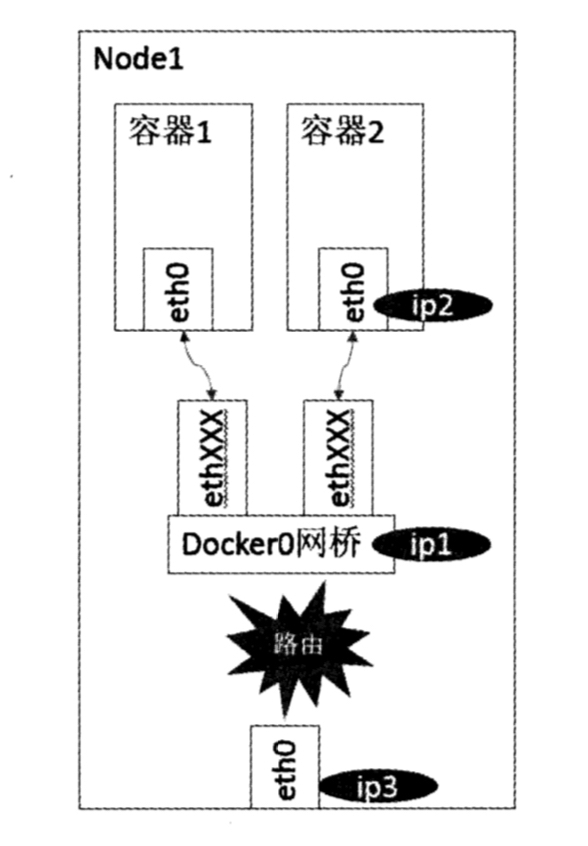

# Docker 
## Docker Cheetsheet
```
# start/stop/restart docker service
$ sudo systemctl start[stop][restart] docker
# view details about docker installation
$ docker info

# configure docker mirror
$ vi /etc/docker/daemon.json
# {"registry-mirrors": ["https://dockerhub.azk8s.cn", "https://hub.daocloud.io/", "https://registry.docker-cn.com"]}
# private registry, mapping host port 5000 [first] to container port 5000 [second]
# registry itself is a docker container
$ docker run -d -p 5000:5000 --restart=always --name registry registry
# search images in private registry
$ curl host:5000/v2/_catalog
# search docker images related to hadoop/tomcat
$ docker search hodoop[tomcat]
# download image from mirror/registery
$ docker pull [host:5000]/hadoop:0.1.0
# show local images
$ docker images

# run a image as a container
$ docker run [-options] image-name
$ docker run -it registry/image-name[:version] /bin/bash
# remove a local image, if any running container refer to the image, remove action will fail
$ docker rmi image-name:version
# docker image [cmd] is a new tool to manage images
$ docker image rm image-name:version
# show running containers
$ docker ps
# start a new bash session in the container
$ docker exec -ti container_id bash
# docker conatainer [cmd] is a  new tool to manage container
$ docker container ls [--all]
# stop a container
$ docker container stop container-id

# 制作镜像相关
$ docker commit 
$ docker build
$ docker tag
$ docker save
$ docker export
$ docker load
$ docker push
```

## Dockerfile
Dockerfile defines what goes on in the environment inside your container. Access to resources like networking interfaces and disk drives is virtualized inside this environment, which is isolated from the rest of your system, so you need to map ports to the outside world, and be specific about what files you want to "copy in" to that environment. However, after doing that, you can expect that the build of your app defined in this Dockerfile behaves exactly the same wherever it runs.
```
# Use an official Python runtime as a parent image
FROM python:2.7-slim

# Set the working directory to /app
WORKDIR /app

# Copy the current directory contents into the container at /app
COPY . /app

# Install any needed packages specified in requirements.txt
RUN pip install --trusted-host pypi.python.org -r requirements.txt

# Make port 80 available to the world outside this container
EXPOSE 80

# Define environment variable
ENV NAME World

# Run app.py when the container launches
# CMD 执行容器应用的入口函数，主函数必须前台执行
CMD ["python", "app.py"]
```
1) Dockfile 必须以 FROM 命令开始，指定该 image 的 Base image （ARG 时唯一能出现在 FROM 之前的命令，指定 FROM 中使用的参数）
2) 以 '#' 开头的行为注释行
3) 可以定义环境变量 `ENV var_name var_value` 在之后使用
4) RUN 指令有两种用法 `RUN <command>` 和 `RUN ["executable", "param1", "param2"]`，docker 构建 image 时，会执行 RUN 指令内容，创建新的镜像层
5) CMD 指令有三种形式	`CMD ["executable", "param1", "param2"]`, `CMD ["param1", "param2"]`, `CMD command param1 param2`. 一个 Dockerfile 中只有一个 CMD 指令，如果有多个，则只有最后一个会生效。构建 image 时并不执行 CMD 指令内容，基于 image 启动 container 后，在 container 内默认执行 CMD 指令内容。`docker run ` 如果指定命令行参数，则会取代 CMD 指令执行
6) ENTRYPOINT 指令有两种形式 `CMD ["executable", "param1", "param2"]`, `CMD command param1 param2`. 和 CMD 的相似之处是，ENTRYPOINT 指令也会在 container 启动后执行；不同之处是 ENTRYPOINT 指令内容不会被 `docker run ` 命令行参数替代。
7) LABEL 指令为生成的镜像添加 meta 信息，执行 `docker inspect image-name` 时可以查看镜像的元信息
8) EXPOSE 指令告知使用者，将 image 启动为 container 时需要监听相应的端口
9) ADD 指令有两种格式 `ADD [--chown=<user>:<group>] <src>... <dest>` 和 `ADD [--chown=<user>:<group>] ["<src>",... "<dest>"]`, 该指令从 src (src 可以是 url 地址，如果 src 是可识别的压缩文件，将被解压) 拷贝文件到 image 中的 dest 目录下，并可设定 image 下相应文件的用户和用户组
10) COPY 指令有两种格式 `COPY [--chown=<user>:<group>] <src>... <dest>` 和 `COPY [--chown=<user>:<group>] ["<src>",... "<dest>"]`, 该指令从当前主机 src 拷贝文件到 image 中的 dest 目录下，并可设定 image 下相应文件的用户和用户组
11) VOLUME creates a mount point with the specified name and marks it as holding externallly mounted volumes from native host or other containers. Volume 让 docker 容器可以操作宿主机的目录，并在宿主机的目录中留下持久化信息。除了在 Dockerfile 中定义 VOLUME，还可以在容器启动时创建。
```
# 下面命令在启动容器时，将宿主机 /host/dir 内容映射到容器 /container-dir 下（如果容器文件系统中本来有相应目录，则其内容将被屏蔽）
# 在容器中，可以读宿主机对应目录（/host/dir）下的文件内容，对 /container-dir 中文件内容进行操作将会被持久化到宿主机对应的目录下
# 这种将宿主机目录和容器目录进行绑定的挂载叫作 bind mount，现在一般不推荐使用
$ docker run --name sepcify-container-name -it -v /host/dir:/container-dir image-name /bin/bash
# 除了使用 -v 标识，还可以使用 --mount 标识进行挂载，--mount 标识更加明确，应该优先使用
# docker run -d -it --name container-name --mount type=bind,source=/host/dir,taregt=/container-dir image-name

# 下面命令启动容器后，对 /container-dir 下文件内容的操作也会持久化到宿主机对应目录下，只不过宿主机的对应目录时自动生成的
# 例如 /var/lib/docker/volumes/0ab0aaf0d6ef391cb68b72bd8c43216a8f8ae9205f0ae941ef16ebe32dc9fc01/_data
# 可以使用 docker inspect container-name 查看目录的对应关系
# 这种由系统自动创建主机目录的 volume 多用于多个容器共享，并且避免用户主动在主机上对应目录下进行文件更改
# 在 Dockerfile 中，使用 VOLUME 指令生成的挂载点，不能指定宿主机目录（因为不确定每个会运行该镜像的机器上都会有这个目录）
# 在 Dockerfile 中，使用 VOLUME 指令生成的挂载点也类似下面指令生成的挂载点
$ docker run --name sepcify-container-name -it -v /container-dir image-name /bin/bash
# 共享其它容器的挂载点
$ docker run --name sepcify-container-name-2 -it --volumes-from sepcify-container-name image-name /bin/bash

# 除了上述 bind mount 类型，现在更推荐使用由 docker dameon 管理宿主机的挂载目录
# 使用 inspect 查看 volume 具体信息，可以发现 docker dameon 在宿主机上 docker 的工作目录创建/管理 volume 的实际空间
$ docker volume create[/inspect/rm] my-vol
$ docker run -d --name container-name --mount source=my-vol,taregt=/container-dir image-name
# 如果使用 mount 挂载宿主机上尚未被创建的 volume，docker dameon 会创建 volume 后提供给 container 使用
$ docker run -d --name container-name --mount source=vol-not-yet-created,taregt=/container-dir image-name
``` 
12) USER 指令 `USER <user>[:<group>]` 或者 `USER <UID>[:<GID>]` ，指定基于 image 启动容器的用户身份，另外 Dockerfile 中，跟随 USER 指令后的 RUN, CMD and ENTRYPOINT 等指令也会以 USER 指令指定的用户身份进行。默认情况下容器中的进程是以 container 中 root 用户身份权限运行的，并且 container 中的 root 和宿主机的 root 是同一个用户
13) WORKDIR 指令 `WORKDIR /path/to/workdir` 设定跟随其后的 RUN, CMD and ENTRYPOINT 等指令的工作目录，它可以多次出现，用以改变工作目录
14) ARG 指令 `ARG <name>[=<default value>]` 指令定义一个变量，可以在 `docker build` 时使用 `--build-arg <varname>=<value>` 进行指定

基于 Dockfile 创建 image
```
$ cd /path-to-dockfile-dir
# version 默认为 latest，下面命令在 local registry 创建 image-name 的 repository，tag 为 version
$ docker build --tag=image-name:version .
# 可以为基于 local image 创建某个 registry 上的 repository
$ docker tag image-name[:tag] [registryhost/][username/]repository[:tag] 
$ 也可以直接将 image 注册到远端 registry
$ docker build -t [registryhost/][username/]repository:tag .
# 在远端 registry 上创建 repository 后，才能将 image:tag 上传到远端 registry 上
$ docker push [registryhost/][username/]repository:tag
```

## Docker registry vs docker repository
Docker registry is a service that is storing your docker images. Docker registry could be hosted by a third party, as public or private registry.
Docker repository is a collection of different docker images with same name, that have different tags. Tag is alphanumeric identifier of the image within a repository.
A registry is a collection of repositories, and a repository is a collection of images.

## Docker 网络原理
Docker 支持 host, container, node, bridge（默认） 等几种网络模式，这里我们以 bridge 模式来说明其网络通信原理。在 bridge 模式下，我们在宿主机（Node）上启动 docker 进程时，该进程会创建一个虚拟的网桥，默认的名字是 docker0，这个网桥拥有一个私有的子网 IP 网段。之后创建的每一个容器（docker run image-name），都会使用宿主机（Linux）操作系统的网络命名空间技术，为容器创建一个独立的网络命名空间，docker0 会为容器分配一个子网 IP 地址。同时，创建一个虚拟的以太网设备（Veth 设备对），其中一端映射到容器私有的网络命名空间内的 eth0 设备，另一端，关联到网桥 docker0 上。

如图所示，同一个宿主机（Node)上的不同容器（容器一和容器二）位于同一子网网段中，相互之间可以使用 IP 地址直接通信。不同 Node 上的容器的通信，可以借助宿主机实现（当然，宿主机之间的网络必须是互通的）。一个简单的做法是将宿主机的不同端口分配给每一个容器(容器也需要指定对接端口)，网络流量通过宿主机端口路由或代理，通过 docker0 转发到相应的容器上。